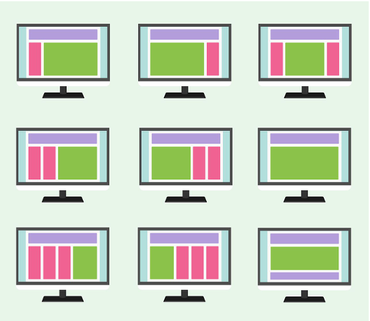

# MAQUETACIÓN WEB. APUNTES

## Índice

1. [Maquetación. Introducción](#maquetación-web-introducción)
2. [Maquetación con CSS-Grid y FlexBox](CSS-Grid_FlexBox.md)


<br><br>
Referencias:
* [MDN. Diseño CSS](https://developer.mozilla.org/es/docs/Learn/CSS/CSS_layout)

<br><br><br>

## Maquetación Web. Introducción
<br>

### ¿ Qué es la maquetación de una página Web ?
<br>

La maquetación web es el proceso de **planificación, conceptualización y organización de contenido de una página web**, es decir, asegura que los textos, las imágenes, los vídeos, como todo lo que quieras añadir a una página web, estén estructurados para crear una buena experiencia de usuario.

<br>


Hoy en día, la maquetación web va más allá de la estética para incluir la funcionalidad general de una página web, teniendo en cuenta la arquitectura de la información. Esto también incluye aplicaciones web, aplicaciones móviles y el diseño de interfaz de usuario.


### ¿ Cómo voy a conseguir esta maquetación ?
<br>

Basicamente:

* **Etiquetas**: <br>
  *div* principalmente y las etiquetas semánticas de HTML5 *header, footer, section, article,aside, dialog, main, summary*... <br>
  Aportan semática dandole conocimiento al Navegador y los buscadores ya saben qué contenido contienen pero a nivel estructural funcionan igual que un *div*. <br><br>

* **CSS**: <br>
  Con propiedades CSS y con algunas estándares que vienen con CSS3 (FlexBox y CSSGrid.)


**¿ Por qué no se utilizan TABLAS para Maquetar ?**

Hace unos años las tablas eran las estructuras base de la maquetación, pero gracias a la evolución de CSS y a los inconvenientes que presentan se han dejado de utilizar para este uso.

Inconvenientes de usar tablas:

* No hay separación entre apariencia y contenido.
* Mucho esfuerzo si ha cambio de diseño.
* Problemas para hacer páginas responsivas.
* Son menos accesibles.
* Se cargan de manera más lenta.
* Son menos legigles (etiquetas semáticas)
* Y funcionan pero para el SEO.

<br>
Un ejemplo de Maquetación muy claro es la siguiente imagen:

<br>



Cada cuadrado de la imagen no es más que una zona de mi página web, o sea que maquetar no es más que definir cada uno de esos cuadrados que van a dar la apariencia visual de mi página web.


### Recomendaciones para maquetar correctamente

* **Realizar siempre un esquema previo**.<br>
  Esto se puede hacer en un folio o en una herramienta digital que permita hacer Mockups o Wireframe, que no es más que un prototipado rápido de un Web.<br>

* Diseñar siempre "**de lo grande a lo chico**".
* **Usa las DevTools.**
  Todos los navegadores traen herramientas para los desarrolladores. Usalas como un pro.

* **Copia**
  Hay millones de Webs, intenta clonar páginas por tí mismo, empezando fácil e ir subiendo de nivel, utilizando las DevTools.<br>
* Prueba distintos navegadores.
* **Cada navegador** tiene sus propias características, versión, evolución, hojas de estilos... es fundamental que tu página se vea bien en la mayoría de los navegadores.
* **Paciencia**, mucha paciencia.
  La maquetación web no es difícil pero requiere la compresión de ciertas reglas básicas y su perfecto encaje posterior.
  Al principio te desesperarás, pensarás que el navegador funciona mal, pero no es así, el navegador muestra lo que tú le dices.

<br><br>

### El flujo de los elementos

Para comprender el flujo de cómo elementos se muestran en el navegador hay que tener presente una serie de consideraciones:

* Todas las etiquetas HTML que se representan lo hacen en **forma de Caja**, con sus propiedades: Margin, Border, Padding...
* Los navegadores no hacen **NADA** para controlar el diseño de nuestra Web, solo muestran los elementos HTML en el mismo orden en que los hemos puesto.
* Siguen las 2 reglas básicas dependiendo de la caja:
  * Se pone unos encima de otros. (Block)
  * Se ponen unos al lado de otros (Inline)
  

<br>

#### Elementos en Línea y en Bloque

* Los elementos **inline**, **no rompen el flujo de la línea** y se van colocando uno detrás de otro mientras caben. Aceptan margin y padding pero solo se tienen en cuenta los valores horizontales. Ignoran width y height. Ejemplos: `<span>,,<a>, <b>`, etc…

* Los elementos **inline-block** funcionan exactamente como los anteriores pero podremos asignarles width y height.

* Los **elementos en bloque** rompen el flujo de la línea y provocan “un salto de línea” tanto anterior como posterior. Por defecto, si no lo especificamos, ocuparán toda la anchura de la etiqueta que los contiene, la etiqueta contenedora. Ejemplos: `<h1>,<p>,<section>,<div>,<li>,<nav>`, etc, …

> Ejemplo: ejemplos/display-tipos [01.display-tipos.html](ejemplos/01.display-tipos/01.display-tipos.html)

<br><br>

### Tipos de Layouts

Existen diferentes tipos de layout, pudiendo distinguir los diferentes tipos:

### **Fixed**

Se especifica de manera fija los tamaños (anchura) de los elementos en pixeles.

> Ventajas:
* Siempre el mismo tamaño
* Total control

> Desventajas:
* Pantallas pequeñas -> Scroll horizontal (esto es el mal).
* Pantallas grandes -> mucho espacio en blanco a los lados.

Ejemplo: ejemplos/layout-tipos [02.1 fixed](ejemplos/02.layout-tipos/fixed/fixed.html)


#### **Elastic**

Se establece el tamaño (anchura) en medidas "em", es decir, en base al tamaño por defecto de la letra. 

> Ventajas:
* Tamaño en "em" escala correctamente.

> Desventajas:
* Elementos adyacentes los elementos pueden solaparse.
* Habría que probar en todo tipo de dispositivos y tamaños de letra.
* Igual que Fixed, scroll horizontal en pantallas pequeñas.

Ejemplo: ejemplos/layout-tipos [02.2 elastic](ejemplos/02.layout-tipos/elastic/elastic.html)


#### **Fluid**

Se establece el tamaño (anchura) en %, en relación al tamaño de mi pantalla que % va a ocupar mi diseño.

> Ventajas:
* La proporción de los elementos es siempre la misma.

> Desventajas:
* En pantallas pequeñas las columnas pueden ser muy estrechas.
* En columnas estrechas texto largos -> celdas muy altas.
* Problemas si hay imágenes y vídeos.

Ejemplo: ejemplos/layout-tipos [02.3 fluid](ejemplos/02.layout-tipos/fluid/fluid.html)


#### **Hibrido**

Que tenga un % pero con una longitud máxima o mínima. De esta forma subsanamos algunos inconvenientes de Elastic.


#### **Responsivo**

Es un diseño que cambia en función del tamaño de la pantalla, es decir, que tendría un diseño distinto en función del tipo de pantalla y por ende, normalmente del tipo de dispisitivo donde se visualiza.

Este punto lo trataremos en el próximo tema, [Diseño Responsivo.](../UD8/DWR.%20apuntes.md)


**¿ Qué diseño elegir ?**
Pues va a depender de los requerimientos:

* Si se muestran en distintas pantallas/dispositivos.
* Público objetivo.
* ...

Hoy en día el diseño responsivo es una mezcla de todos, y es el que más se usa, utilizando ciertas técnicas de los otros diseños.


### Box-sizing

El box-sizing nos indica cómo se calcula el tamaño de los elementos HTML, desde el punto de vista del modelo de caja.
Es decir, si para el cálculo de su tamaña (anchura y altura) se tienen en cuenta solo el contenido, el border y el padding, ...

Para estudiar este punto leer este [articulo.](../UD6/conceptos/CSS.Box-sizing.md)


### Centrado del Layout/Diseño

Cuando hablamos de centrar un elemento nos referimos a centrarlo dentro de un contexto (su etiqueta padre) o etiqueta/caja contenedora.

2 tipos de centrado:

* Centrado vertical
* Centrado horizontal

Suele ser un tema que da muchos dolores de cabeza a los principiantes. Vamos a intentar aclarar este tema:

#### **Centrado Horizontal**

* Elementos *inline*:  añadiremos `text-align:center` al contenedor padre.
* Elementos *'block'* en su contenedor `margin: X auto` al elemento que queremos centrar (X es una distancia expresada en cualquier unidad). El elemento debe tener anchura.
  
* Varios elementos *block*:
  * Añadir la propiedad `text-align:center` al contenedor padre.
  * Añadir la propiedad `display:inline-block` a los elementos a centrar.

* Usar contenedores *flex* aunque esto lo veremos en siguientes puntos.


#### **Centrado Vertical**

> Elementos *inline*

Se puede conseguir:
* Con el mismo `padding`arriba y abajo.
* Añadiendo `vertical-align:middle` si dentro de celda de tabla o similando con propiedad display.
* Con contenedores `flex`

> Elementos *block*
> 
Se puede conseguir:
* Utilizando propiedad `position` en el contenedor y en el elemento.
* Con contenedores `flex.`

Ejemplo: ejemplos/centrar-layout [03 Centrado elementos](ejemplos/03.centrar-layout/centrado.html)


### Propiedad Position: Posicionando elementos

A veces es neceario mover los elementos con respecto a dónde les correspondería según el flujo normal atendiendo a su propiedad display.

Esto es útil cuando queremos realizar detalles más finos a nivel de maquetación.


Esto se realiza con la propiedad `position`:

* **Static**:<br>
  Es el valor por defecto. El elemento sigue el flujo que lo que corresponde. Aunque use top,bottom,left,right o z-index al elemento no se aplica ningún desplazamiento.<br>

* **Relative**
 Es como static pero si atiende a los desplazamientos expresados en top,bottom,left,right o z-index.<br>

* **Absolute**
  Se comporta como fixed pero en relación con la primera etiqueta padre que tenga position:relative.<br>

* **Fixed**
  Se le aplica `top,bottom,right,left` o `z-index` en relación con documento. No atiende al scroll una vez generada por lo que su posición siempre permanece fija.<br>

* **Sticky**
  Se comporta como relative hasta llegar a una posición de scroll y a partir de entonces fixed.<br>

  * **Inherit**
  La propiedad position no se propaga en cascada, si queremos que se propague necesitamos indicar este valor.<br>

Y va unido a las propiedades Top,Bottom, Left y Righ (desplazamiento) y z-index (capas).


**La propiedad z-index**

Al posicionar los elementos con las propiedades position puede suceder que nos encontremos que haya elementos que lleguen a solaparse por tener que ocupar la misma área.

Con `z-index` podemos establecer capas decidiendo el orden de solapamiento de estos elementos. Se mostrará arriba del todo aquel elemento de los que se solapen con el mayor valor de z-index.


**Centrado vertical de elementos de bloque con Propiedad: Position**

na vez ya sabemos usar la propiedad position podemos centrar verticalmente elementos de bloque. Nos encontraremos con dos casos:

* Cuando conocemos la altura del elemento.
* Cuando desconocemos la altura del elemento.

Si conocemos la altura del elemento y esta es por ejemplo 150px:
```css
css {
.contenedor {
  position: relative;
}

.elemento_a_centrar {
  height: 150px;
  margin-top: -75px; /** La mitad de la altura **/
  position: absolute;
  top: 50%;
}
```

Si desconocemos la altura del elemento:
```css
css {
.contenedor {
  position: relative;
}

.elemento_a_centrar {
  height: 150px;
  margin-top: -75px; /** La mitad de la altura **/
  position: absolute;
  top: 50%;
}
```

> Ejemplo: ejemplos/position [04 Propiedad-Position](ejemplos/04.position/positioning.html)


<br><br>

¿Donde continuar ahora?

[Maquetación y Diseño Responsivo con Flexbox y CSS Grid](CSS-Grid_FlexBox.md)


<br><br><br><br><br>

### Articulos interesantes para profundizar
<br>

1. **[Normal Fow](https://developer.mozilla.org/es/docs/Learn/CSS/CSS_layout/Normal_Flow)**
   Los elementos en las páginas web se presentan de acuerdo con el flujo normal, hasta que hacemos algo que cambie eso. Este artículo explica las bases del flujo normal para aprender como cambiarlo.

2. **[Posicionamiento](https://developer.mozilla.org/en-US/docs/Learn/CSS/CSS_layout/Positioning)**
   El posicionamiento te permite sacar elementos del flujo normal de maquetación del documento para hacer que se comporten de manera diferente, p.ej: colocando unos encima de otros, o fijándolos a un lugar de la ventana principal. Este artículo explica los diferentes valores para  position y cómo utilizarlos.

3. **[CSS-Grid](https://developer.mozilla.org/en-US/docs/Learn/CSS/CSS_layout/Grids)**
   Los sistemas de cuadrícula son otra funcionalidad muy utilizada para la maquetación CSS, con CSS-Grid la maquetación Web sufrió una revolución sin precedentes.

4. **[FlexBox](https://developer.mozilla.org/en-US/docs/Learn/CSS/CSS_layout/Flexbox)**
   Flexbox es un nuevo estándar de CSS3 soportada ya por numerosos navegadores, está lista para su uso generalizado. Flexbox proporciona las herramientas necesarias para crear rápidamente maquetaciones flexibles y complejas, así como otras funcionalidades que tradicionalmente eran de difícil implementación con CSS.

5. [Unidades de medida en CSS: Porcentajes](https://lupitacode.medium.com/porcentajes-css-5cbb95967989)
 
6. [EM vs REM. ¿Cúal debería usar?](https://lupitacode.medium.com/porcentajes-css-5cbb95967989)

