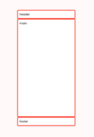
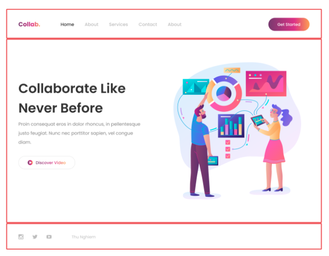
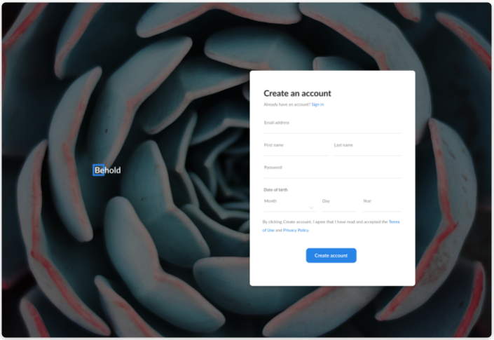
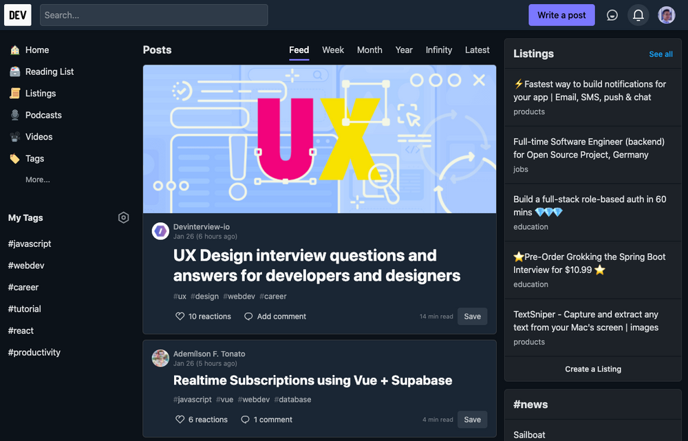

# 5 diseños muy usados

## 1. Header-Main-Footer (1columna - 3 filas)

 

 > Un ejemplo de Web que se puede realizar con este diseño

  

 

 
 

## 2. Header-Main-Footer (1columna - 3 filas)

 

 > Un ejemplo de Web que se puede realizar con este diseño

  

 

 
 

## 3. Responsivo diseño (3 diseños)

 

El diseño tiene 3 tipos: Mobile, Tablet y Desktop.

 

> Un ejemplo de Web que se puede realizar con este diseño

  

 

 

Este se puede realizar con CSS-Grid de 2 formas:

1. Con `grid-template-column` y `grid-template-row`
2. Con `grid-template-area`

 
