# Trabajando con classes en el DOM con Javascript

En JavaScript, es común necesitar agregar y eliminar clases.

Demostremos cómo hacerlo, empezando por comentar todo el código dentro de `the-dom.js`.

Cuando selecciona un elemento, tendrá un atributo `classList`, y ese atributo tiene métodos para agregar y eliminar varias clases.

Haremos un ejemplo con animación.

Duplica una de las etiquetas de imagen y agrégala justo después de la etiqueta del cuerpo de apertura, y dale una clase de agradable. 👇

```html
<body>

```

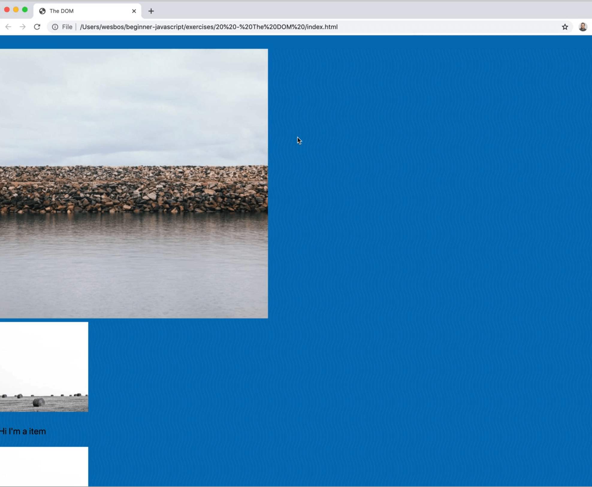

Dentro de `the-dom.js`, agregue el siguiente código para seleccionar el elemento usando la clase de `nice`, y luego registraremos el atributo `classList` del elemento.

```js
const pic = document.querySelector('.nice');
console.log(pic.classList)
```

545 / 5.000
Resultados de traducción
En la consola obtenemos una **DOMTokenList** que es como una matriz de todas las clases que están en esa imagen.

En el archivo HTML, agregue también una clase de `genial` a la imagen.

Cuando actualice la página, verá que obtenemos ambos, así como un valor de todas las clases. 👇

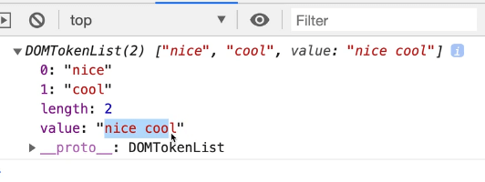

Si observa el **prototipo** _(todavía no hemos aprendido qué es)_, puede ver qué métodos están disponibles para llamar contra lo que tenemos.

`classList` tiene muchos metodos.

Por nombrar algunos..
- `add`
- `remove`
- `contains`
- `foreach`.

Muchos de estos métodos se utilizan para trabajar con classes CSS que es exactamente lo que vamos a hacer:

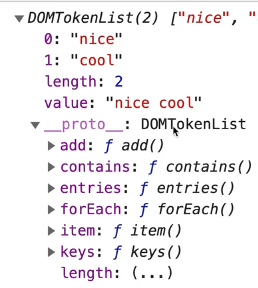

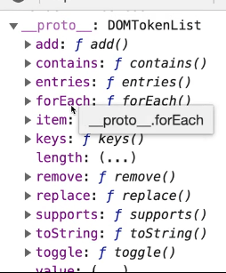

Dentro de VS Code, existen ayuda cuando escribimos, viendo los métodos disponibles. 👇

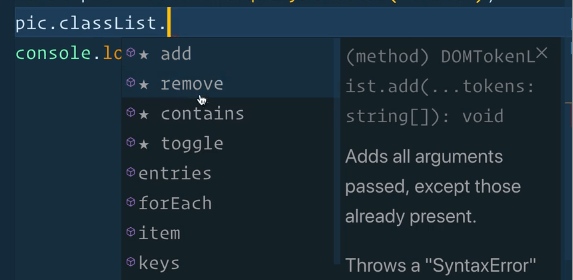

## Adding a class

Vamos a usar `pic.classList.add()` para añadir la clase 'open'.

```js
const pic = document.querySelector(".nice");
pic.classList.add("open");
console.log(pic.classList);
```

Refresca la página e inspeccionala, verás como ahora la imagen tiene otro selector clases aplicado. Ahora tiene la clase 'open'.

## Borrando una clase

¿Qué pasaría si quisiéramos eliminar la clase de "genial" que ya existe en el elemento?

Podrías hacerlo con el siguiente código 👇

```js
pic.classList.remove('cool');
```

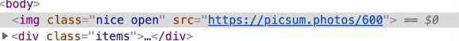

## Toggling a class

Existe también `toggle` que es super útil.

Escribamos un poco de CSS para que podamos ver visualmente lo que está pasando.

En nuestro `index.html` agrega una etiqueta de estilo en algún lugar de la página con los siguientes estilos 👇

```html
<style>
  .round {
    border-radius: 50%;
  }
</style>
```

Ahora usando Javascript, agregamos la clase `round`.

```js
pic.classList.add('round');
```

Ahora el elemento tiene la clase de round y make la imagen circular..

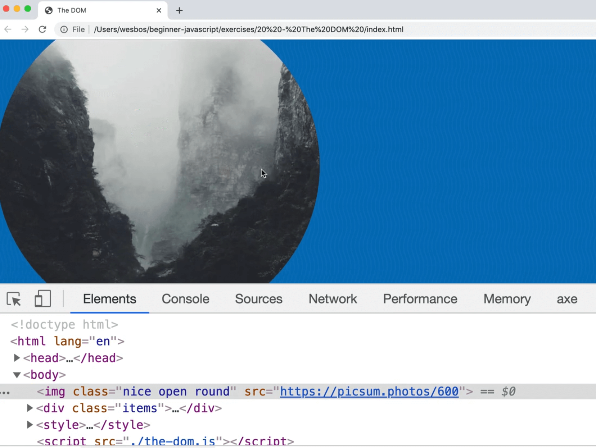

Podemos agregar y borrar esta clase o bien pegarla desde la consola o haciendo click.

Ahoremos ambas cosas.

Reemplaza el `add` metodod usada antes por `toggle()`.

`toggle` añade la clases si el elemento no la tiene, o la borra si la tiene aplicada..

```js
pic.classList.toggle('round');
```

Si copia y pega esa línea de código en la consola, verá que la clase se agrega y luego se elimina.


Si ingresamos a nuestro CSS y agregamos una transición durante .2 segundos, eso nos dará una animación cuando la clase cambie.

```css
img {
  transition: all 0.2s;
}

.round {
  border-radius: 50%;
  transform: rotate(1turn) scale(2);
  box-shadow: 0 0 10px black;
}
```

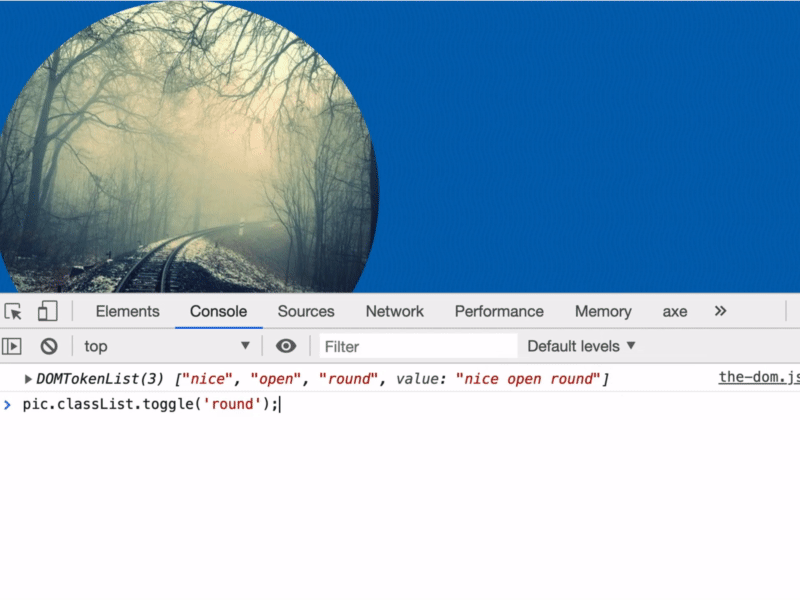

```js
function toggleRound(){
  pic.classList.toggle('round');
}

pic.addEventListener('click', toggleRound);
```

Lo que estamos haciendo allí es decir que cuando se hace clic en el elemento pic, queremos activar la función llamada `toggleRound()`, que activará y desactivará la clase de `.round` para el elemento de imagen.

Puede agregar los siguientes estilos a la clase `.round` también para una transición de rotación..

```css
.round {
  border-radius: 50%;
  transform: rotate(20deg);
}
```

El CSS agregado 👆 arriba te dará la transición que se muestra a continuación 👇

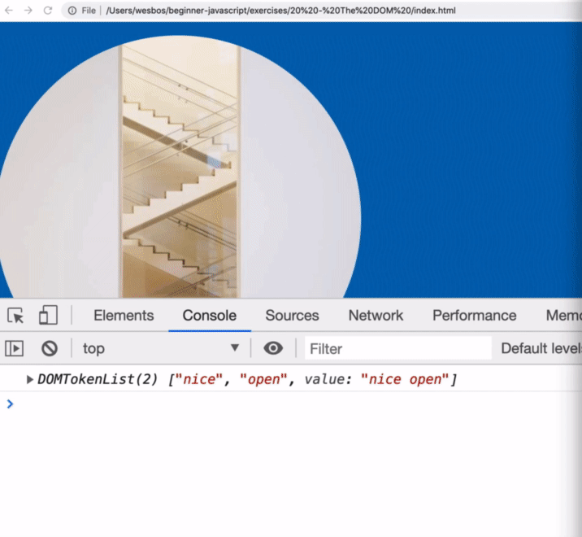

```css
.round {
  border-radius: 50%;
  transform: rotate(2000deg);
}
```

Para obtener el efecto de transición a continuación 👇 agrega el código que se muestra arriba 👆

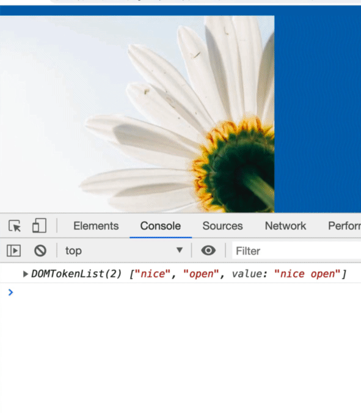

```css
.round {
  border-radius: 50%;
  transform: rotate(1turn) scale(2);
}
```

El código de arriba 👆 te da el efecto de abajo 👇

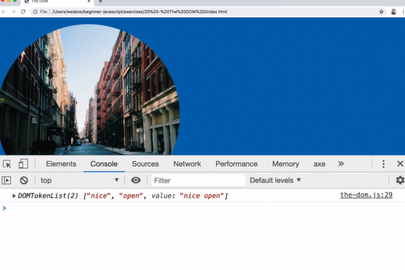

Gran parte de la interacción de JavaScript consiste simplemente en agregar y eliminar clases en diferentes momentos. Eso permite a los desarrolladores de JavaScript usar CSS para agregar y eliminar transiciones.

Eso es común con los modales y la navegación que se abren y cierran, y repasaremos muchos ejemplos de eso a lo largo de la clase.

## El método 'Contains'

También existe el método `contains()`, que usarías así 👇

```js
pic.classList.contains('open');
```

Devolverá un valor booleano de `verdadero` o `falso` en función de si ese elemento tiene la clase o no.

Eso es útil cuando desea verificar el estado actual de un elemento mirando su lista de clases.

En el próximo video repasaremos los atributos regulares.

Aunque `clase` es un atributo, `classList` nos proporciona algunos métodos de utilidad para trabajar con ella.

Cada vez que Wes necesita trabajar con clases, usa `classList`, que tiene algunos años pero es bastante más reciente.