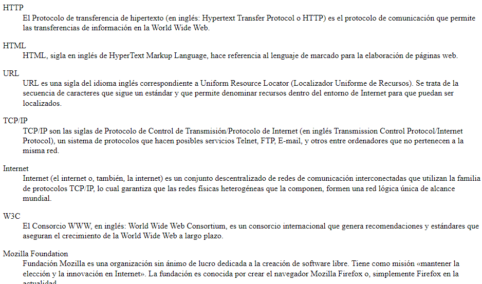

# BOLETÍN 5. EJERCICIOS BÁSICOS DISEÑO WEB

## Ejercicio 1

En el código base que se te proporciona debes realizar los siguientes cambios:

* Las siglas HTML deben aparecer como texto destacado en toda la página.
* Tim Berners-Lee debe aparecer como texto enfatizado en toda la página.

Debes añadir el siguiente contenido:
* Un encabezado de nivel 1 con el texto "HTML" antes de "HTML son las siglas de..."
* Un encabezado de nivel 2 con el texto "Historia de HTML" antes de "Los inicios del lenguaje HTML..."
* Un encabezado de nivel 2 con el texto "Versiones de HTML" antes de dos nuevos párrafos que contienen el texto "Tim Berners-Lee definió la primera versión de HTML en el año 1991" y "En la actualidad, la última versión de HTML es HTML5".

El resultado final debe ser una página web que tenga el mismo aspecto que la siguiente imagen: 


<br><br><br>


## Ejercicio 2

A partir del texto que se te proporciona, debes crear una página web que tenga el mismo aspecto que la siguiente imagen:


Además, tienes que tener en cuenta los siguientes requisitos:

* El título de la página debe ser Tim Berners-Lee.
* El texto "Tim Berners-Lee" como encabezado de nivel 1.
* El texto "Biografía" como encabezado de nivel 2.
* Todas las siglas, como HTTP, W3C o MIT deben aparecer como texto destacado.
* Los nombres de las instituciones o empresas, como Consorcio de la World Wide Web o Universidad de Oxford, deben aparecer como texto enfatizado.


Código base:

```text
Tim Berners-Lee

Sir Timothy "Tim" John Berners-Lee (Londres, Reino Unido, 8 de junio de 1955) es un científico de la computación británico, conocido por ser el padre de la Web. Estableció la primera comunicación entre un cliente y un servidor usando el protocolo HTTP en noviembre de 1989. En octubre de 1994 fundó el Consorcio de la World Wide Web (W3C) con sede en el MIT, para supervisar y estandarizar el desarrollo de las tecnologías sobre las que se fundamenta la Web y que permiten el funcionamiento de Internet.

Biografía

Nació en el sudoeste de Londres en 1955. Sus padres eran matemáticos y formaron parte del equipo que construyó el Manchester Mark I (una de las primeras computadoras). Durante el tiempo que estuvo en la universidad, construyó una computadora con una soldadora, circuitos TTL, un procesador Motorola 68000 y un televisor viejo. Se graduó en física en 1976 en el Queen's College de la Universidad de Oxford. Conoció a su primera esposa en este periodo. En 1978, trabajó en D.G. Nash Limited (también en Poole) escribió un sistema operativo.

Desarrollo de su carrera

Berners-Lee trabajó en el CERN desde junio hasta diciembre de 1980. Durante ese tiempo, propuso un proyecto basado en el hipertexto para facilitar la forma de compartir y la puesta al día de la información entre investigadores. En este periodo también construyó un programa llamado Enquire que no llegó a ver la luz.

Después de dejar el CERN, en 1980, se fue a trabajar a la empresa de John Poole Image Computer Systems Ltd., pero regresó al CERN otra vez en 1984.

En 1989, el CERN era el nodo de Internet más grande de Europa y Berners-Lee vio la oportunidad de unir Internet y el hipertexto (HTTP y HTML), de lo que surgiría la World Wide Web. Desarrolló su primera propuesta de la Web en marzo de 1989, pero no tuvo mucho eco, por lo que en 1990 y con la ayuda de Robert Cailliau, hicieron una revisión que fue aceptada por su gerente, Mike Sendall. Usó ideas similares a las que había usado en el sistema Enquire para crear la World Wide Web, para esto diseñó y construyó el primer navegador (llamado WorldWideWeb y desarrollado con NextStep) y el primer servidor web al que llamó httpd (HyperText Transfer Protocol daemon).

Fuente: Wikipedia
```
<br><br><br>

## Ejercicio 3

Corrige los errores que presenta el código base que se te proporciona.

```html
<html lang=es>
<head>
<title>World Wide Web</title>
</head>
<body>

<h1>World Wide Web</h1>

<p>
En informática, la <strong><em>World Wide Web</strong></em> (WWW) o Red informática mundial comúnmente conocida como la web, es un sistema de distribución de documentos de hipertexto o hipermedios interconectados y accesibles vía Internet. Con un navegador web, un usuario visualiza sitios web compuestos de páginas web que pueden contener texto, imágenes, vídeos u otros contenidos multimedia, y navega a través de esas páginas usando hiperenlaces.

<h2>Historia</h2>

<p>
La web se desarrolló entre marzo de 1989 y diciembre de 1990 por el inglés Tim Berners-Lee con la ayuda del belga Robert Cailliau mientras trabajaban en el CERN en Ginebra, Suiza, y publicado en 1992.
</p>

<p>
Desde entonces, Berners-Lee ha jugado un papel activo guiando el desarrollo de estándares web (como los lenguajes de marcado con los que se crean las páginas web), y en los últimos años ha abogado por su visión de una web semántica.
</p>

<p>Fuente: <em>Wikipedia</p></em>

</html>
```
<br><br><br>


## Ejercicio 4

A partir del texto que se te proporciona, debes crear una página web que tenga el mismo aspecto que la siguiente imagen:


Además, tienes que tener en cuenta los siguientes requisitos:

* El título de la página debe ser Curriculum Vitae de Bruce Wayne.
* El resto de la estructura de la página debes deducirlo a partir de la imagen proporcionada


Código base:

```text
Curriculum Vitae de Bruce Wayne

Datos personales
 Nombre completo:  Bruce Wayne
 Fecha de nacimiento: 1/5/1939
 Lugar de nacimiento:  Gotham City

Formación académica
 1956-1961: Universidad del Espantapájaros
 1952-1956: Instituto de Dos Caras
 1944-1952:  Escuela Primaria del Joker

Experiencia laboral
 1975-1985: En el paro
 1965-1975: Cazavillanos y demás chusma
 1962-1965: Aprendiz de superhéroe
```
<br><br><br>

## Ejercicio 5

A partir del texto que se te proporciona, debes crear una página web que tenga el mismo aspecto que la siguiente imagen:


Además, tienes que tener en cuenta los siguientes requisitos:

* El título de la página debe ser Los tres pilares de la Web.
* Los enlaces que aparecen en la página deben tener los siguientes destinos:
  * Tim Berners-Lee → http://es.wikipedia.org/wiki/Tim_Berners-Lee
  * Web → http://es.wikipedia.org/wiki/World_Wide_Web
  * HTML → enlace intradocumental al epígrafe HTML
  * HTTP → enlace intradocumental al epígrafe HTTP
  * URL → enlace intradocumental al epígrafe URL
  * Fuente: HTML → http://es.wikipedia.org/wiki/HTML
  * Fuente: HTTP → http://es.wikipedia.org/wiki/Hypertext_Transfer_Protocol
  * Fuente: URL → http://es.wikipedia.org/wiki/Localizador_de_recursos_uniforme


Código base:

```text
Los tres pilares de la Web

Tim Berners-Lee es considerado el padre de la Web porque desarrolló los tres elementos básicos para el funcionamiento de la Web:

HTML
HTTP
URL

HTML

HTML, siglas de HyperText Markup Language, hace referencia al lenguaje de marcado para la elaboración de páginas web. Es un estándar que sirve de referencia para la elaboración de páginas web en sus diferentes versiones, define una estructura básica y un código (denominado código HTML) para la definición de contenido de una página web, como texto, imágenes, entre otros. Es un estándar a cargo de la W3C, organización dedicada a la estandarización de casi todas las tecnologías ligadas a la web, sobre todo en lo referente a su escritura e interpretación. Es el lenguaje con el que se definen las páginas web.

Fuente: HTML, Wikipedia

HTTP

Hypertext Transfer Protocol o HTTP (en español protocolo de transferencia de hipertexto) es el protocolo usado en cada transacción de la World Wide Web. HTTP fue desarrollado por el World Wide Web Consortium y la Internet Engineering Task Force, colaboración que culminó en 1999 con la publicación de una serie de RFC, el más importante de ellos es el RFC 2616 que especifica la versión 1.1.

Fuente: HTTP, Wikipedia

URL

Un localizador de recursos uniforme o URL —siglas en inglés de Uniform Resource Locator— es un identificador de recursos uniforme (URI) cuyos recursos referidos pueden cambiar, esto es, la dirección puede apuntar a recursos variables en el tiempo. Están formados por una secuencia de caracteres, de acuerdo a un formato modélico y estándar, que designa recursos en una red, como Internet.

Fuente: URL, Wikipedia
```
<br><br><br>

## Ejercicio 6

Crear una lista de definiciones a partir del texto que se entrega:



Código base:

```text
HTTP
El Protocolo de transferencia de hipertexto (en inglés: Hypertext Transfer Protocol o HTTP) es el protocolo de comunicación que permite las transferencias de información en la World Wide Web.

HTML
HTML, sigla en inglés de HyperText Markup Language, hace referencia al lenguaje de marcado para la elaboración de páginas web.

URL
URL es una sigla del idioma inglés correspondiente a Uniform Resource Locator (Localizador Uniforme de Recursos). Se trata de la secuencia de caracteres que sigue un estándar y que permite denominar recursos dentro del entorno de Internet para que puedan ser localizados.

TCP/IP
TCP/IP son las siglas de Protocolo de Control de Transmisión/Protocolo de Internet (en inglés Transmission Control Protocol/Internet Protocol), un sistema de protocolos que hacen posibles servicios Telnet, FTP, E-mail, y otros entre ordenadores que no pertenecen a la misma red.

Internet
Internet (el internet o, también, la internet)​ es un conjunto descentralizado de redes de comunicación interconectadas que utilizan la familia de protocolos TCP/IP, lo cual garantiza que las redes físicas heterogéneas que la componen, formen una red lógica única de alcance mundial.

W3C
El Consorcio WWW, en inglés: World Wide Web Consortium, es un consorcio internacional que genera recomendaciones y estándares que aseguran el crecimiento de la World Wide Web a largo plazo.​

Mozilla Foundation
Fundación Mozilla es una organización sin ánimo de lucro dedicada a la creación de software libre. Tiene como misión «mantener la elección y la innovación en Internet». La fundación es conocida por crear el navegador Mozilla Firefox o, simplemente Firefox en la actualidad.
```
<br><br><br>

## Ejercicio 7

A partir del texto que se te proporciona, debes crear una página web que tenga el mismo aspecto que la siguiente imagen:


Selecciona para cada lista el mejor tipo de lista.

Código base:

```markdown
Internet

Contenido

Principales protocolos
Formas de conectarse

Principales protocolos

Transmisión de ficheros:
FTP

Correo electrónico:

IMAP
POP
SMTP

Formas de conectarse

Red Telefónica Conmutada (RTC)
La línea telefónica de toda la vida.  Para acceder a Internet es necesario un módem.

Red Digital de Servicios Integrados (RDSI)
Una línea telefónica especial. Para acceder a Internet es necesario un módem RDSI.

Línea de Abonado Digital Asimétrica (ADSL)
Se basa en la conversión de una línea RTC en una línea de alta velocidad. Para acceder a Internet es necesario un módem ADSL.</dd>

Fibra Óptica
Una línea de fibra óptica. Normalmente la fibra óptica no llega hasta el usuario final, por lo que el término más apropiado es Fibra híbrida coaxial.

```
<br><br><br>


## Ejercicio 8

A partir del texto que se te proporciona, debes crear una página web que tenga el mismo aspecto que la siguiente imagen:


> **Nota**: en el código base que se te proporciona vas a encontrar una etiqueta nueva, la etiqueta "style". Esta etiqueta permite introducir instrucciones de CSS (Cascading Style Sheets) en una página web. CSS se emplea para definir la presentación visual de una página web y se explica en la segunda parte de este curso. Las instrucciones que se han incluido tienen como objetivo que la tabla y las celdas de la tabla se muestren con un borde. Esto también se podría haber logrado con el atributo border de HTML, pero es mejor utilizar siempre CSS para todo lo relacionado con la presentación de una página web.

Código base:

```text
<!DOCTYPE html>
<html>
<head>
<title>Desempleo</title>
<style>
table, tr, th, td {
  border: 1px solid black;
}
</style>
</head>
<body>

El desempleo en España


La siguiente tabla muestra la evolución del desempleo en España, comparado con la media de los 27 países de la Unión Europea, Grecia, que compite con España en ser el primero en esta vergonzosa competición y Estados Unidos y Japón, dos de las primeras economías mundiales.


País
2000
2001
2002
2003
2004
2005
2006
2007
2008
2009
2010
2011
2012
2013


UE (27 países)
8.9
8.7
9
9.1
9.3
9
8.2
7.2
7
9
9.6
9.6
10.4
10.8


España
11.9
10.6
11.5
11.5
11
9.2
8.5
8.2
11.3
17.9
19.9
21.4
24.8
26.1


Grecia
11.2
10.7
10.3
9.7
10.6
10
9
8.4
7.8
9.6
12.7
17.9
24.5
27.5


Estados Unidos
4
4.8
5.8
6
5.5
5.1
4.6
4.6
5.8
9.3
9.6
8.9
8.1
7.4


Japón
4.7
5
5.4
5.3
4.7
4.4
4.1
3.9
4
5.1
5.1
4.6
4.3
4


Fuente: Índice de desempleo anual, Eurostat

</body>
</html>
```
<br><br><br>

## Ejercicio 9

A partir del texto que se te proporciona, debes crear una página web que tenga el mismo aspecto que la siguiente imagen:


> **Nota**: en el código base que se te proporciona vas a encontrar una etiqueta nueva, la etiqueta "style". Esta etiqueta permite introducir instrucciones de CSS (Cascading Style Sheets) en una página web. CSS se emplea para definir la presentación visual de una página web y se explica en la segunda parte de este curso. Las instrucciones que se han incluido tienen como objetivo que la tabla y las celdas de la tabla se muestren con un borde. Esto también se podría haber logrado con el atributo border de HTML, pero es mejor utilizar siempre CSS para todo lo relacionado con la presentación de una página web.

codigo base:

```html
<!DOCTYPE html>
<html>
<head>
<title>Tabla compleja</title>
<style>
table, tr, th, td {
  border: 1px solid black;
}
</style>
</head>
<body>
Categoría	Etiquetas

Formulario
form
button
input
select
textarea

Tabla
table
tr
th
td
caption

Texto
b
em
i
strong
sub
sup
</body>
</html>
```
<br><br><br>

## Ejercicio 10

Crea una página web que contenga un formulario con los siguientes campos de información:

* El nombre, con un control de tipo texto.
* Los apellidos, con un control de tipo texto.
* El sexo, con dos opciones excluyentes hombre o mujer.
* El correo electrónico, con un control de tipo texto.
* Una casilla de verificación con el texto "Deseo recibir información sobre novedades y ofertas".
* Una casilla de verificación con el texto "Declaro haber leido y aceptar las condiciones generales del programa y la normativa sobre protección de datos".
* Un botón de envío.

Además, tienes que tener en cuenta los siguientes requisitos:

* El título de la página debe ser Formulario de registro - Mi web.
* El método de envío del formulario debe ser GET.
* El destino del envío del formulario debe ser "".
* La longitud máxima de entrada de datos de los controles para el nombre y los apellidos debe ser 50 caracteres.
* La casilla de verificación con el texto "Deseo recibir información sobre novedades y ofertas" debe estar activada por defecto.
* Debes crear una página web que tenga el mismo aspecto que la siguiente imagen:


<br><br><br>