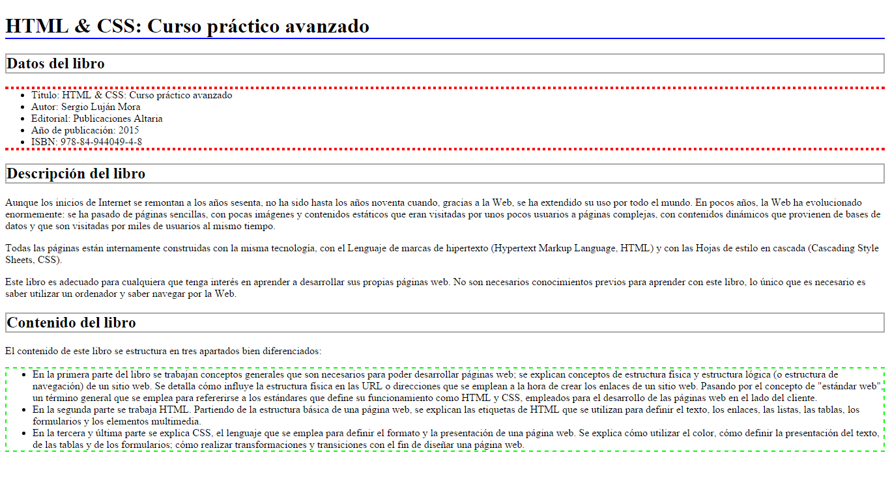
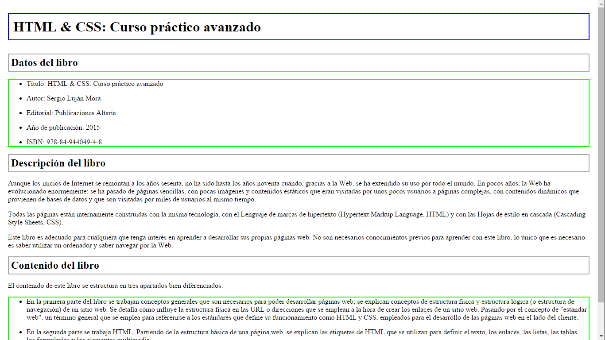
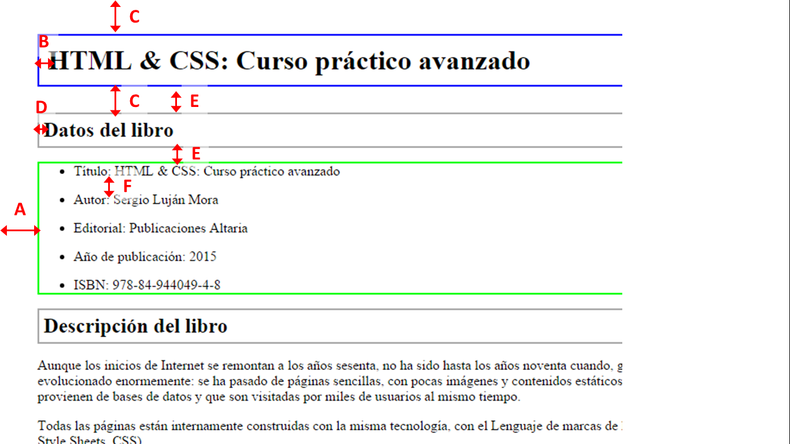

# BOLETÍN 6. EJERCICIOS INTRODUCCIÓN CSS

Para la resolución de cada ejercicio, es necesario crear una carpeta con nombre "01.Ejercicio" y colocar los ficheros necesarios dentro.<br>
Los ficheros que son necesarios se indicarán en cada ejercicio.

## Ejercicio 1

En base al código HTML y CSS, agregar los selectores CSS que se faltan.<br>
Cada regla CSS posee un comentario que indica a qué elementos se aplica.

> Crear un único fichero "01.Ejercicio\index.html", con los estilos CSS aplicados dentro de la etiqueta `<style>`

```html
<!doctype html>
<html>
<head>
<meta charset="utf-8">
<title>Ejercicio de selectores</title>
<style type="text/css">
/* Todos los elementos de la pagina */
{ font: 1em/1.3 Arial, Helvetica, sans-serif; }

/* Todos los parrafos de la pagina */
{ color: #555; }

/* Todos los párrafos contenidos en #primero */
{ color: #336699; }

/* Todos los enlaces la pagina */
{ color: #CC3300; }

/* Los elementos "em" contenidos en #primero */
{ background: #FFFFCC; padding: .1em; }

/* Todos los elementos "em" de clase "especial" en toda la pagina */
{ background: #FFCC99; border: 1px solid #FF9900; padding: .1em; }

/* Elementos "span" contenidos en .normal */
{ font-weight: bold; }

</style>
</head>

<body>

<div id="primero">
<p>Lorem ipsum dolor sit amet, <a href="#">consectetuer adipiscing elit</a>. Praesent blandit nibh at felis. Sed nec diam in dolor vestibulum aliquet. Duis ullamcorper, nisi non facilisis molestie, <em>lorem sem aliquam nulla</em>, id lacinia velit mi vestibulum enim.</p>

</div>

<div class="normal">
<p>Phasellus eu velit sed lorem sodales egestas. Ut feugiat. <span><a href="#">Donec porttitor</a>, magna eu varius luctus,</span> metus massa tristique massa, in imperdiet est velit vel magna. Phasellus erat. Duis risus. <a href="#">Maecenas dictum</a>, nibh vitae pellentesque auctor, tellus velit consectetuer tellus, tempor pretium felis tellus at metus.</p>

<p>Cum sociis natoque <em class="especial">penatibus et magnis</em> dis parturient montes, nascetur ridiculus mus. Proin aliquam convallis ante. Pellentesque habitant morbi tristique senectus et netus et malesuada fames ac turpis egestas. Nunc aliquet. Sed eu metus. Duis justo.</p>

<p>Donec facilisis blandit velit. Vestibulum nisi. Proin volutpat, <em class="especial">enim id iaculis congue</em>, orci justo ultrices tortor, <a href="#">quis lacinia eros libero in eros</a>. Sed malesuada dui vel quam. Integer at eros.</p>
</div>

</body>
</html>
```
<br>

## Ejercicio 2

En base al código HTML, agregar los selectores CSS que requeridos para obtener el resultado indicado.<br>


```html
<!doctype html>
<html>
<head>
<meta charset="utf-8">
<title>Ejercicio de selectores</title>
</head>

<body>
<h1 id="titulo">Lorem ipsum dolor sit amet</h1>

<p>Nulla pretium. Sed tempus nunc vitae neque. <strong>Suspendisse gravida</strong>, metus a scelerisque sollicitudin, lacus velit
ultricies nisl, nonummy tempus neque diam quis felis. <span class="destacado">Etiam sagittis tortor</span> sed arcu sagittis tristique.</p>

<h2 id="subtitulo">Aliquam tincidunt, sem eget volutpat porta</h2>

<p>Vivamus velit dui, placerat vel, feugiat in, ornare et, urna.  <a href="#">Aenean turpis metus, <em>aliquam non</em>, tristique in</a>, pretium varius, sapien. Proin vitae nisi.  Suspendisse <span class="especial">porttitor purus ac elit</span>. Suspendisse eleifend odio at dui. In in elit sed metus pretium elementum.</p>

<table summary="Descripción de la tabla y su contenido">
<caption>Título de la tabla</caption>
<thead>
  <tr>
    <th scope="col"></th>
    <th scope="col" class="especial">Título columna 1</th>
    <th scope="col" class="especial">Título columna 2</th>
  </tr>
</thead>

<tfoot>
  <tr>
    <th scope="col"></th>
    <th scope="col">Título columna 1</th>
    <th scope="col">Título columna 2</th>
  </tr>
</tfoot>

<tbody>
  <tr>
    <th scope="row" class="especial">Título fila 1</th>
    <td>Donec purus ipsum</td>
    <td>Curabitur <em>blandit</em></td>
  </tr>
  <tr>
    <th scope="row">Título fila 2</th>
    <td>Donec <strong>purus ipsum</strong></td>
    <td>Curabitur blandit</td>
  </tr>
</tbody>
</table>

<div id="adicional">
<p>Donec purus ipsum, posuere id, venenatis at, <span>placerat ac, lorem</span>. Curabitur blandit, eros sed gravida aliquet, risus justo
porta lorem, ut mollis lectus tortor in orci. Pellentesque nec augue.</p>

<p>Fusce nec felis eu diam pretium adipiscing. <span id="especial">Nunc elit elit, vehicula vulputate</span>, venenatis in,
posuere id, lorem. Etiam sagittis, tellus in ultrices accumsan, diam nisi feugiat ante, eu congue magna mi non nisl.</p>

<p>Vivamus ultrices aliquet augue. <a href="#">Donec arcu pede, pretium vitae</a>, rutrum aliquet, tincidunt blandit, pede.
Aliquam in nisi. Suspendisse volutpat. Nulla facilisi. Ut ullamcorper nisi quis mi.</p>
</div>

</body>
</html>
```

> Crear un fichero "02.Ejercicio\index.html" y un fichero "css\syles.css", con los estilos CSS y enlazarlos al fichero index.html

<br><br>

## Ejercicio 03

En base al código HTML, agregar los selectores CSS que requeridos para obtener el resultado indicado.<br>



Los bordes a crear con CSS son:

* Header nivel 1: borde inferior con una anchura de 2px, sólido y de color azul (#00F).
* Header nivel 2: borde completo con una anchura de 2px, sólido y de color gris (#AAA).
* Lista datos del libro: borde superior e inferior con una anchura de 4px, punteado y de color rojo (#F00).
* Lista contenido libro: borde completo con una anchura de 2px, con guiones y de color verde (#0F0).

> Crear un fichero "03.Ejercicio\index.html" y un fichero "css\syles.css", con los estilos CSS y enlazarlos al fichero index.html

> La imagen puede no corresponder exactamente con el texto, lo importante son los estilos.

```html
<!DOCTYPE html>
<html>
<head>
<meta charset="utf-8" />
<title>HTML y CSS: Curso avanzado</title>
</head>
<body>
<h1>HTML y CSS: Curso avanzado</h1>

<h2>Datos del libro</h2>

<ul>
<li>Título: HTML y CSS: Curso avanzado</li>
<li>Autor: Manuel Rodriguez Lena</li>
<li>Editorial: Publicaciones SinRumbo</li>
<li>Año de publicación: 2018</li>
<li>ISBN: 978-98-955049-4-8</li>
</ul>

 

<h2>Info del libro</h2>

<p>
Lorem, ipsum dolor sit amet consectetur adipisicing elit. Provident cum a recusandae, nulla eum fuga ad dolorem inventore dolores corporis sed velit molestias cupiditate iusto animi eius consequuntur accusamus sapiente placeat mollitia exercitationem porro eos nam. Laudantium id, dolor itaque a corporis repudiandae sint maxime amet similique labore inventore aut!
</p>

<p>
Lorem ipsum, dolor sit amet consectetur adipisicing elit. Repudiandae facilis fugiat laborum quo, velit hic culpa at alias vero illum eligendi quisquam nisi omnis libero magni nesciunt dolor, ad beatae nobis nulla labore, accusantium tempore. Adipisci placeat aliquam eius officia!
</p>

<p>
Lorem ipsum, dolor sit amet consectetur adipisicing elit. Cupiditate minus rerum harum totam alias quasi, culpa inventore deserunt corporis adipisci facilis omnis autem labore magnam eveniet delectus perspiciatis error odio?
</p>

 

<h2>Contenido</h2>

<p>
Lorem, ipsum dolor sit amet consectetur adipisicing elit. Animi est atque autem optio laborum quaerat exercitationem nam nobis omnis aliquam!:
</p>

<ul>
<li>Lorem ipsum, dolor sit amet consectetur adipisicing elit. Dolorum reprehenderit, quos vel dolore distinctio repudiandae ipsa vero placeat fugiat autem, odit corporis itaque quibusdam inventore, in est similique numquam cum obcaecati laudantium sapiente quidem sit nobis! Eum deleniti ipsam, expedita hic error, animi odio repellendus harum nihil cum cupiditate! Ipsam sit cupiditate asperiores perspiciatis doloremque amet porro quas molestiae soluta deserunt quasi, inventore unde pariatur vero commodi velit voluptate ad expedita aut cumque magnam non maiores eius! Unde odio a perspiciatis natus, dolores excepturi facere numquam sed tempore accusantium nisi laudantium, repellat vitae inventore incidunt explicabo repellendus magni dolorum adipisci.</li>

<li>Lorem ipsum, dolor sit amet consectetur adipisicing elit. Repudiandae facilis fugiat laborum quo, velit hic culpa at alias vero illum eligendi quisquam nisi omnis libero magni nesciunt dolor, ad beatae nobis nulla labore, accusantium tempore. Adipisci placeat aliquam eius officia!</li>

<li>Lorem ipsum, dolor sit amet consectetur adipisicing elit. Cupiditate minus rerum harum totam alias quasi, culpa inventore deserunt corporis adipisci facilis omnis autem labore magnam eveniet delectus perspiciatis error odio?.</li>
</ul>
</body>
</html>
``` 

<br><br>

## Ejercicio 04

En base al código HTML del ejercicio anterior, agregar los selectores CSS que requeridos para obtener el resultado indicado.<br>



Los bordes a crear con CSS son:

* Header nivel 1: borde completo con una anchura de 2px, sólido y de color azul.
* Header nivel 2: borde completo con una anchura de 2px, sólido y de color gris.
* Listas: borde completo con una anchura de 2px, solido y de color verde.

Además también se deben aplicar las siguientes reglas CSS para que coincidan según la imagen:



* A: relleno izquierdo y derecho de 13px.
* B: relleno de 13 px.
* C: margen superior e inferior de 28px.
* D: relleno de 6 px.
* E: margen superior e inferior de 16px.
* F: margen entre los elementos de la lista de 14 px.

> Crear un fichero "04.Ejercicio\index.html" y un fichero "css\syles.css", con los estilos CSS y enlazarlos al fichero index.html

> La imagen puede no corresponder exactamente con el texto, lo importante son los estilos.

<br><br>

## Ejercicio 05

Aplica los estilos correspondientes para obtener el siguiente resultado:


> Crear un fichero "05.Ejercicio\index.html" y un fichero "css\syles.css", con los estilos CSS y enlazarlos al fichero index.html


Reglas a aplicar:

1. Centra en la página en texto del título.
2. Da a todas las imágenes el mismo tamaño 50x50px
3. Utilizando clases y una regla de selección haz que todas las celdas con texto de la primera columna
tengan fondo rojo y letra blanca 
4. Añadiendo sólo un id a la fila de la celda donde pone "Capacidad" y dando clase a las celdas con "GB" 
cambiar el tamaño de la letra centrar el texto y poner el fondo gris
5. Añadiendo sólo un id a la fila que las contiene añade estilos a los elementos de la lista que están dentro de
esa fila para ponerles color de texto rojo.
6. Utilizando un id aumenta el padding superior e inferior a la celda en la que pone "5 horas" y dale fondo amarillo
7. Dar lo estilos adecuados para poner un borde simple colapsado y centrar la tabla.
8. Dar color de fondo azul a todas las celdas que tiene colspan="2" o colspan="3"


<br><br>

RECURSOS A UTILIZAR.

* HTML 
  
```html
<!DOCTYPE html>
<html lang="es">

<head>
    <meta charset="UTF-8">
    <meta name="viewport" content="width=device-width, initial-scale=1.0">
    <meta http-equiv="X-UA-Compatible" content="ie=edge">
    <title>Ejercicio práctico con selectores</title>
    <link rel="stylesheet" href="css/estilos.css" type="text/css" />
</head>

<body>
    <h1>Ejercicio práctico con Tablas</h1>

    <table>
        <caption></caption>
        <thead>
            <tr>
                <th></th>
                <th colspan="3"></th>
                <th colspan="2"></th>
            </tr>
        </thead>
        <tbody>
            <tr id="fila">
                <th class="primera">Capacidad</th>
                <td class="gb">
                    <p>2GB</p>
                </td>
                <td class="gb">
                    <p>4GB</p>
                </td>
                <td class="gb">
                    <p>8GB</p>
                </td>
                <td class="gb">
                    <p>32GB</p>
                </td>
                <td class="gb">
                    <p>2GB</p>
                </td>
            </tr>
            <tr id="listas">
                <th class="primera">Colores</th>
                <th>Blanco</th>
                <td>
                    <ul>
                        <li>Negro</li>
                        <li>Rosa</li>
                        <li>Dorado</li>
                    </ul>
                </td>
                <th>Negro</th>
                <td colspan="2">
                    <ul>
                        <li>Negro</li>
                        <li>Blanco</li>
                    </ul>
                </td>
            </tr>
            <tr>
                <th class="primera">Pantalla</th>
                <th colspan="3">3 pulgadas</th>
                <th colspan="2">7 pulgadas</th>
            </tr>
            <tr>
                <th rowspan="2" class="primera">Tiempo de Carga</th>
                <th colspan="3" rowspan="2">1 hora</th>
                <th colspan="2" id="cinco">5 horas</th>
            </tr>
            <tr>
                <th colspan="2">30 minutos para 75%</th>
            </tr>
        </tbody>


    </table>

</body>

</html>
```

* CSS

y crea un archivo CSS llamado `styles.css` dentro de la carpeta CSS. Puedes copiar el código a continuación para que resulte más fácil su realización.

```css
/* Centra en la página en texto del título */


/* Da a todas las imágenes el mismo tamaño 50x50px */

/*Utilizando clases y una regla de selección haz que todas las celdas con texto de la primera columna
tengan fondo rojo y letra blanca*/


/* Añadiendo sólo un id a la fila de la celda donde pone "Capacidad" y dando clase a las celdas con "GB" 
cambiar el tamaño de la letra centrar el texto y poner el fondo gris */

/* Añadiendo sólo un id a la fila que las contiene añade estilos a los elementos de la lista que están dentro de
esa fila para ponerles color de texto rojo*/

/*Utilizando un id aumenta el padding superior e inferior a la celda en la que pone "5 horas" y dale fondo amarillo*/

/* Dar lo estilos adecuados para poner un borde simple colapsado y centrar la tabla */


/* Dar color de fondo azul a todas las celdas que tiene colspan="2" o colspan="3"*/


```

<br><br>

## Ejercicio 06

Aplica los estilos correspondientes para obtener el siguiente resultado:


> Crear un fichero "06.Ejercicio\index.html" y un fichero "css\syles.css", con los estilos CSS y enlazarlos al fichero index.html


**Reglas a aplicar:**

1. Tabla border colapsado y un borde 1px, solido y color negro.
2. Utilizando únicamente pseudoselectores da color de fondo verde a las casillas que contienen horas.
3. Utilizando únicamente pseudoselectores da color de fondo amarillo a la celda de recreo.
4. Cambiar los estado de los enlaces para que:
   1. Nunca estén subrayados
   2. Si están visitados se muestren en rojo
   3. Si no están visitado se muestren en verde
5. Utilizando pseudoselectores hacer que cuando pasemos el ratón sobre la columna del viernes aumente el tamaño de letra al doble.
6. Utilizando Pseudoelementos Haz que la primera letra de los días tenga el doble de tamaño.
7. Añade un borde rojo que esté separado 5 px a los campos obligatorios.
8. Añade un * en rojo detrás de las etiquetas.


<br><br>

RECURSOS A UTILIZAR.

* HTML 
  
```html
<!DOCTYPE html>
<html lang="es">

<head>
    <meta charset="UTF-8">
    <meta name="viewport" content="width=device-width, initial-scale=1.0">
    <meta http-equiv="X-UA-Compatible" content="ie=edge">
    <title>Ejercicios con Pseudoselectores</title>

    <link href="css/estilos.css" type="text/css" rel="stylesheet" />
</head>

<body>
    <table>
        <caption><a href="#" target="_blank">HORARIO DE CLASE CURSO</a></caption>
        <thead>
            <tr>
                <th>HORAS</th>
                <th>Lunes</th>
                <th>Martes</th>
                <th>Miércoles</th>
                <th>Jueves</th>
                <th>Viernes</th>
            </tr>
        </thead>
        <tbody>
            <tr>
                <td>8:00</td>
                <td rowspan="2">Matemáticas</td>
                <td>Lengua</td>
                <td>Inglés</td>
                <td colspan="2">Ciencias</td>
            </tr>
            <tr>
                <td>9:00</td>
                <td>Historia</td>
                <td>Ciencias</td>
                <td>Matemáticas</td>
                <td>Lengua</td>
            </tr>
            <tr>
                <td>10:00</td>
                <th colspan="5">RECREO</th>
            </tr>
            <tr>
                <td>10:30</td>
                <td>Inglés</td>
                <td rowspan="2">Ciencias</td>
                <td>Matemáticas</td>
                <td>Lengua</td>
                <td>Historia</td>
            </tr>
            <tr>
                <td>11:30</td>
                <td>Historia</td>
                <td>Ciencias</td>
                <td>Matemáticas</td>
                <td>Inglés</td>
            </tr>
        </tbody>
    </table>

    <form>
        <p>
            <label for="destino">Email</label>
            <input type="email" name="destino" placeholder="Inserte email del destinario" required />
        </p>
        <input type="button" value="Enviar Horario" />
    </form>
</body>

</html>
```

* CSS

y crea un archivo CSS llamado `styles.css` dentro de la carpeta CSS. Puedes copiar el código a continuación para que resulte más fácil su realización.

```css
/* Tabla border colapsado y un borde 1px, solido y color negro.
*/

/* Utilizando únicamente pseudoselectores da color de fondo verde a las casillas que contienen horas */


/* Utilizando únicamente pseudoselectores da color de fondo amarillo a la celda de recreo */


/* Cambiar los estado de los enlaces para que:

 Nunca estén subrayados
 Si están visitados se muestren en rojo
 Si no están visitado se muestren en verde */


/* Utilizando pseudoselectores hacer que cuando pasemos el ratón sobre la columna del viernes
aumente el tamaño de letra al doble */


/* Utilizando Pseudoelementos Haz que la primera letra de los días tenga el doble de tamaño*/

/* Añade un borde rojo que esté separado 5 px a los campos obligatorios */


/* Añade un * en rojo detrás de las etiquetas */


```