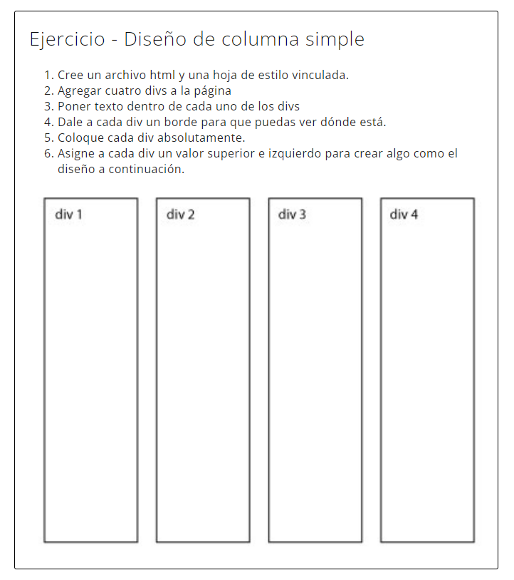
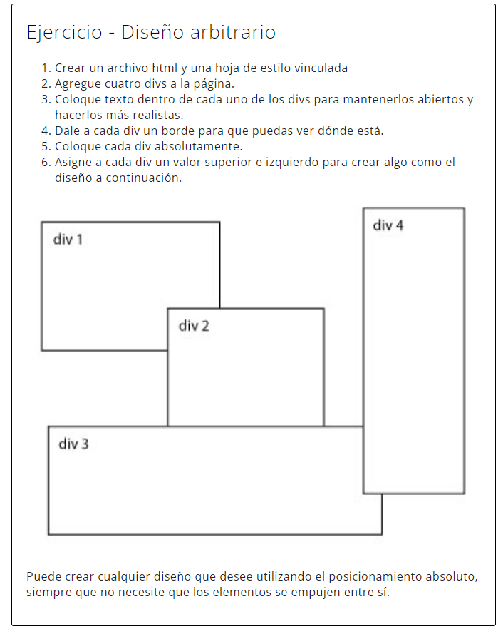

# BOLETÍN 7. EJERCICIOS CSS POSITION

En este boletín vamos a trabajar la maquetación, trabajando con ejercicios más simples e iremos subiendo de dificultad.


    Notas 💡
    
    Para la entrega será necesario crear un carpeta 'b7' dentro de la carpeta 'Bloque2'.

    Para cada ejercicio hay que crear una sub-carpeta XX.Ejercicio (03.Ejercicio), y dentro los elementos (html).
    - Para los ficheros CSS se creará una carpeta 'css' y se colocarán los ficheros CSS necesarios. El fichero CSS lo llamaremos 'style.css'.
    - Si hubiera imágenes se creará una carpeta "img".
    
    Para muchos ejercicios se da un código HTML y/o CSS de base, que tendréis que copiar en los ficheros 'index.html' y/o 'style.css'. Recordar vincular el CSS al HTML.

    Todos los ejercicios será requeridos subirlos al repositorio Github privado de cada uno.

    Además, será necesario entregar el documento del boletín, anexando la ruta de la carpeta 'b7' de vuestro repositorio. Este documento se entregará en el classroom para que quede constancia de la entrega.

    ⚡Importante

    No se podrá modificar la carpeta 'b7' ni ninguno de los ejercicios realizados con fecha posterior a la fecha máxima de entrega del boletín.
    Si lo habéis entregado, y quereis modificarlo de nuevo, los podéis hacer hasta la fecha máxima de entrega.
    
<br>

### 💢 **Propiedad: Position**

<br>

## Ejercicio 1: Diseño de columna simple
<br>

Crear un único fichero "01.Ejercicio\index.html", con una hoja de estilos vinculadas para que el resultado sea el mostrado en la imagen.
Para ello hay que utilizar la propiedad `position`, no se puede realizar con la propiedad `display.`

> Solo crear el cuadro externo y los div internos. El texto no se debe incluir en el resultado.




<br>

## Ejercicio 2: Diseño arbitario

Crear un único fichero "02.Ejercicio\index.html", con una hoja de estilos vinculadas para que el resultado sea el mostrado en la imagen.
Para ello hay que utilizar la propiedad `position`, no se puede realizar con la propiedad `display.`

> Solo crear el cuadro externo y los div internos. El texto no se debe incluir en el resultado.



<br><br>

## Ejercicio 03: Diseño Sticky

En base al código HTML y CSS de base suministrado conseguir el resultado que se muestra en la imagen.<br>


HTML base
```html
<!DOCTYPE html>
<html>
<head>
<meta charset="utf-8" />
<title>HTML y CSS: Curso avanzado</title>
</head>
<body>
<main class="main-container">
  <header class="main-header">HEADER</header>
  <div class="main-content">MAIN CONTENT</div>
  <footer class="main-footer">FOOTER</footer>
</main>
</body>
</html>
```

CSS
```css
body{
    color:#fff;
    font-family:arial;
    font-weight:bold;
    font-size:40px; 
}

.main-container{ 
    max-width:600px; 
    margin:0 auto; 
    border:solid 10px green; 
    padding:10px; 
    margin-top:40px;
}

.main-container * {
    padding:10px;
    background:#aaa; 
    border:dashed 5px #000;
}

.main-container * + *{
    margin-top:20px;
}

.main-header{
  height:50px; 
  background:#aaa;
  border-color:red;
}

.main-content{
  min-height:1000px;
}

.main-header {
    /* INCLUYE LAS PROPIEDADES NECESARIAS*/
}
```

