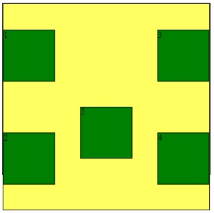
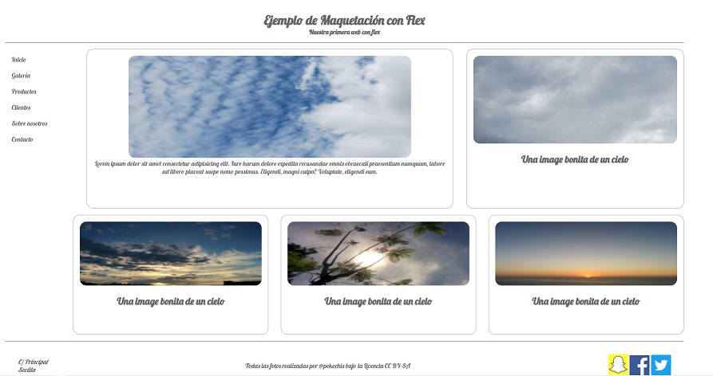
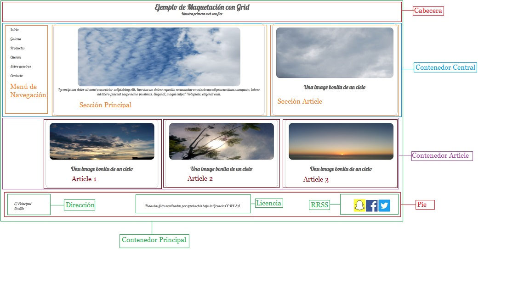
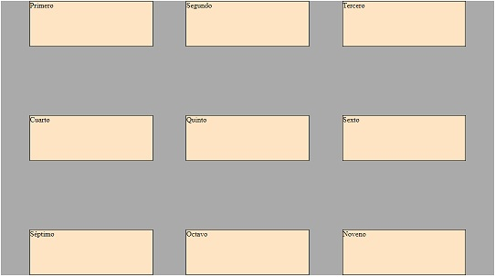
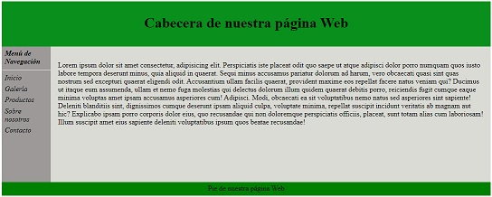
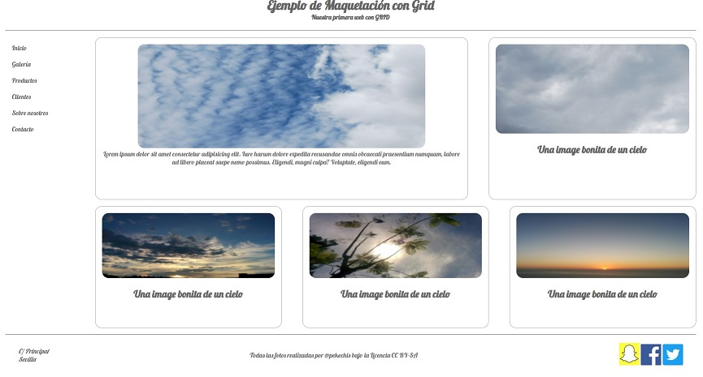
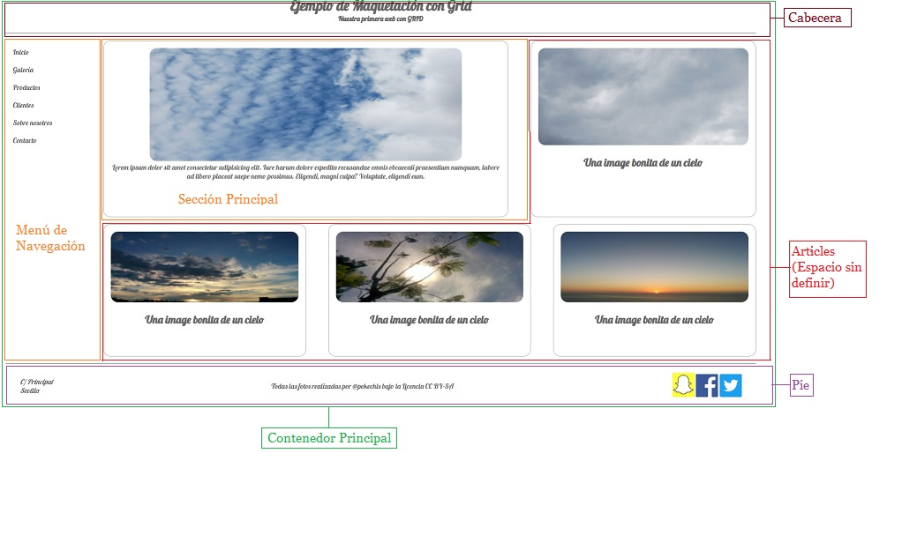

# BOLETÍN 8. EJERCICIOS MAQUETACIÓN FLEXBOX y CSS-Grid

En este boletín vamos a trabajar la maquetación, trabajando con ejercicios más simples e iremos subiendo de dificultad.


    
    ✔️ Obtener recursos

    Para facilitar el obtener los recursos (imagenes, etc..) y no tener que descargarlas una a una, lo mejor es que os cloneis este repositorio completo.
    Si ya lo habéis hecho, simplemente obtener los cambios y ya tendréis actualizado el repositorio del curso en vuestro ordenador.

    Notas 💡
    
    Para la entrega será necesario crear un carpeta 'b8' dentro de la carpeta 'Bloque2'.

    Para cada ejercicio hay que crear una sub-carpeta XX.Ejercicio (03.Ejercicio), y dentro los elementos (html).
    - Para los ficheros CSS se creará una carpeta 'css' y se colocarán los ficheros CSS necesarios. El fichero CSS lo llamaremos 'style.css'.
    - Si hubiera imágenes se creará una carpeta "img".
    
    Para muchos ejercicios se da un código HTML y/o CSS de base, que tendréis que copiar en los ficheros 'index.html' y/o 'style.css'. Recordar vincular el CSS al HTML.

    Todos los ejercicios será requeridos subirlos al repositorio Github privado de cada uno.

    Además, será necesario entregar el documento del boletín, anexando la ruta de la carpeta 'b7' de vuestro repositorio. Este documento se entregará en el classroom para que quede constancia de la entrega.

    ⚡Importante

    No se podrá modificar la carpeta 'b8' ni ninguno de los ejercicios realizados con fecha posterior a la fecha máxima de entrega del boletín.
    Si lo habéis entregado, y quereis modificarlo de nuevo, los podéis hacer hasta la fecha máxima de entrega.
    
<br>

## Ejercicio 1. FLEX. Elementos Flexibles

Debéis crear una capeta llamada Ejercicio1 y dentro de esta habrá otra llamada css. 

HTML base:

```HTML
<!DOCTYPE html>
<html lang="es">
<head>
    <meta charset="UTF-8">
    <meta http-equiv="X-UA-Compatible" content="IE=edge">
    <meta name="viewport" content="width=device-width, initial-scale=1.0">
    <title>Ejercicio 1</title>
</head>
<body>
    <div class="container">
        <div>1</div>
        <div>2</div>
        <div>3</div>
        <div>4</div>
        <div>5</div>
    </div>   
</body>
</html>
```

CSS base:

```CSS
*{
    box-sizing: border-box;
}

.container {
    border: 1px solid;
    background-color: rgba(255, 255, 0, 0.623);
    height: 400px;
    width: 400px;
}

div {
    background-color: green;
    border: 1px solid;
    height: 100px;
    width: 100px;   
}
```

Inicialmente la página tiene este aspecto:


Debéis modificar la hoja de estilos de tal manera que:
1. El contenedor principal de nuestra web será de tipo FLEX.
2. Los elementos flexibles tengan una dirección de derecha a izquierda.
3. Los elementos flexibles que no quepan en el contenedor pasen a la parte de arriba. 
4. Se distribuye el espacio libre del contenedor FLEX entre los elementos flexibles, pero el primero y el último estén pegados a los bordes.
5. Centrar verticalmente los elementos flexibles.
6. Modificar el orden en el que se muestran los elementos flexibles, mediante CSS, de tal manera que se muestren los elementos flexibles en este orden: 1, 3, 2, 5, 4.
7. El elemento flexible 5 debe estar más arriba que los elementos flexibles que están en su misma línea.

Una vez aplicados estos requerimientos, la página tendrá el siguiente aspecto:
<br><br>


<br>
<hr>
<br>

## Ejercicio 2. FLEX. Web completa con FLEX

<br>

Debéis crear una capeta llamada Ejercicio2 y dentro de esta habrá otra llamada css y otra img. 

HTML base:

```HTML
<!DOCTYPE html>
<html lang="es">
  <head>
    <meta charset="UTF-8" />
    <meta name="viewport" content="width=device-width, initial-scale=1.0" />
    <meta http-equiv="X-UA-Compatible" content="ie=edge" />
    <title>Ejercicio Práctico FLEX</title>

    <link rel="stylesheet" type="text/css" href="css/Ejercicio2.css" />
    <link
      href="https://fonts.googleapis.com/css?family=Lobster"
      rel="stylesheet"
    />
  </head>
  <body>
    <div class="container">
      <header>
        <h1>Ejemplo de Maquetación con Flex</h1>
        <h4>Nuestra primera web con flex</h4>
      </header>
      <div class="content_wrapper">
        <nav>
          <div>Inicio</div>
          <div>Galería</div>
          <div>Productos</div>
          <div>Clientes</div>
          <div>Sobre nosotros</div>
          <div>Contacto</div>
        </nav>
        <main>
          
          <p>
            Lorem ipsum dolor sit amet consectetur adipisicing elit. Iure harum
            dolore expedita recusandae omnis obcaecati praesentium numquam,
            labore ad libero placeat saepe nemo possimus. Eligendi, magni culpa?
            Voluptate, eligendi eum.
          </p>
        </main>

        <article class="article_ppal">
          
          <h2>Una image bonita de un cielo</h2>
        </article>
      </div>
      <div class="articles">
        <article>
          
          <h2>Una image bonita de un cielo</h2>
        </article>
        <article>
          
          <h2>Una image bonita de un cielo</h2>
        </article>
        <article>
          
          <h2>Una image bonita de un cielo</h2>
        </article>
      </div>
      <footer>
        <address>
          <p>C/ Principal</p>
          <p>Sevilla</p>
        </address>
        <div class="copyright">
          Todas las fotos realizadas por @pekechis bajo la Licencia CC BY-SA
        </div>
        <div class="social">
           
          
        </div>
      </footer>
    </div>
  </body>
</html>
``` 
CSS base:

```CSS
* {
    box-sizing: border-box;
}
  
/*Esto es un reseteo de estilos. 
  Los navegadores crean aplican estilos propios a los elementos. Con esto conseguimos quitar los margenes que aplica el navegador */
h1, h4,  p {
    margin: 0px;
}

body {
    background-color: white;
}

.container {
    color: #666666;
    font-family: "Lobster", cursive;
    margin: 20px auto;
    width: 90%;
}

header{
    text-align: center;
    border-bottom: 1px solid #666666;
    padding: 1em;
    margin-bottom: 1em;
    width: 100%;
}

.content_wrapper {
    margin-bottom: 1em;
}

nav {
    width: 10%;
    padding: 1em;
}

nav div {
    margin-bottom: 20px;    
}

main {
    border: 1px solid #666666;
    border-radius: 1em;
    height: 400px;
    width: 54%;
    padding: 1em;
    text-align: center;
}  

main img{
    border-radius: 1em;
    height: 70%;
    width: 80%;
}

.article_ppal {
    height: 400px;
} 


article {
    border: 1px solid #666666;
    border-radius: 1em;
    height: 300px;
    width: 32%;
    padding: 1em;
    text-align: center;
}

article img {
    border-radius: 1em;
    height: 70%;
    width: 100%;
}

.articles {
    margin-left: 10%;
}


footer {
    border-top: 1px solid #666666;
    margin-top: 1em;
    padding: 2em;
}
  
footer img {
    width: 50px;
}
```

Las imagenes de base para este ejercicio se encuentra en la carpeta: 
> res/img_EJ_2_y_6.7z

<br>

Deberemos aplicar estilos a la página para que quede así:



La página tiene la siguiente estructura:



1. Tenemos un **Contenedor Principal** que tiene los definiremos como un contenedor FLEX.
2. Los elementos que sobrepasen las dimensiones del contenedor le diremos que las pase a la linea de abajo.
3. Deberemos definir en el **Contenedor Principal**, que queremos que nuestros elementos tengan espacio entre ellos pero se peguen a los bordes.
4. El **Contenedor Article** deberemos definirlo como otro contenedor flex.
5. Deberemos definir en el **Contenedor Article**, que queremos que nuestros elementos tengan espacio entre ellos pero se peguen a los bordes.
6. El **Pie** será otro contenedor flex.
7. Los elementos flexibles del **Pie** deberán estar centrados en el contenedor principal.
8. Los elementos flexibles del **Pie** tendrán espacio entre ellos pero se peguarán los extremos a los bordes.

<br>
<hr>
<br>

## Ejercicio 3. GRID.

<br>

Debéis crear una página web que tenga el siguiente aspecto final:
<br>



Se usará como HTML el siguiente:
```HTML
<!DOCTYPE html>
<html lang="es">
  <head>
    <meta charset="UTF-8" />
    <meta name="viewport" content="width=device-width, initial-scale=1.0" />
    <meta http-equiv="X-UA-Compatible" content="ie=edge" />
    <title>Ejercicio 3</title>

    <link rel="stylesheet" type="text/css" href="css/Ejercicio3.css" />
  </head>
  <body>
    <div class="container">
      <div>Primero</div>
      <div>Segundo</div>
      <div>Tercero</div>
      <div>Cuarto</div>
      <div>Quinto</div>
      <div>Sexto</div>
      <div>Séptimo</div>
      <div>Octavo</div>
      <div>Noveno</div>      
    </div>
  </body>
</html>
```

Como podéis ver tenemos un contenedor principal con la clase `container` y dentro de el 9 estructuras `div`

La hoja de estilos con la que partirá el ejercicio es la siguiente:

```CSS
* {
    box-sizing: border-box;
  }
  
  .container {
    background-color: #aaa;
    width: 80%;
    height: 600px;
    
  }
 
  .container > div {
    background-color: bisque;
    border: 1px solid black;
  }
```

Para conseguir el resultado final deberéis crear una página de estilos en la que se tengan en cuenta las siguientes características:
1. El contenedor de la clase `container` es de tipo `GRID`.
2. El grid estara formado por:
  * 3 columnas con un tamaño del 25% cada una.
  * 3 filas 100 píxeles cada una.
3. Tendremos 10 píxeles de separación entre columnas.
4. Habrá 20 píxeles de separación entre filas.
5. Los elementos contenidos en el grid tendrán las siguientes características:
  * Una alineación horizontal en la que el espacio restante deberá repartirse entre todos los elementos teniendo en cuenta los bordes.
  * Una alineación vertical en la que el espacio restante se repartirá entre todos los elementos pero la primera y la última fila estará pegada a los bordes del contenedor.

<br>
<hr>
<br>

## Ejercicio 4. GRID AREA.

<br>

Debéis crear una página web que tenga el siguiente aspecto final:


Tenemos 4 areas en nuestra página: Cabecera, Menú de Navegación, Zona Principal y Pie.

Se usará como HTML el siguiente:
```HTML
<!DOCTYPE html>
<html lang="es">
  <head>
    <meta charset="UTF-8" />
    <meta name="viewport" content="width=device-width, initial-scale=1.0" />
    <meta http-equiv="X-UA-Compatible" content="ie=edge" />
    <title>Ejercicio 4</title>

    <link rel="stylesheet" type="text/css" href="css/Ejercicio4.css" />
  </head>
  <body>
    <div class="container">
      <div id="cab"><h1>Cabecera de nuestra página Web</h1></div>
      <div id="menu">
        <p><h4>Menú de Navegación</h4></p>
        <hr>
        <p>Inicio</p>
        <p>Galería</p>
        <p>Productos</p>
        <p>Sobre nosotros</p>
        <p>Contacto</p>
    </div>
    <div id="principal">
        <p>Lorem ipsum dolor sit amet consectetur, adipisicing elit. Perspiciatis iste placeat odit quo saepe ut atque adipisci dolor porro numquam quos iusto labore tempora deserunt minus, quia aliquid in quaerat.
        Sequi minus accusamus pariatur dolorum ad harum, vero obcaecati quasi sint quas nostrum sed excepturi quaerat eligendi odit. Accusantium ullam facilis quaerat, provident maxime eos repellat facere natus veniam qui?
        Ducimus ut itaque eum assumenda, ullam et nemo fuga molestias qui delectus dolorum illum quidem quaerat debitis porro, reiciendis fugit cumque eaque minima voluptas amet ipsam accusamus asperiores cum! Adipisci.
        Modi, obcaecati ea sit voluptatibus nemo natus sed asperiores sint sapiente! Deleniti blanditiis sint, dignissimos cumque deserunt ipsam aliquid culpa, voluptate minima, repellat suscipit incidunt veritatis ab magnam aut hic?
        Explicabo ipsam porro corporis dolor eius, quo recusandae qui non doloremque perspiciatis officiis, placeat, sunt totam alias cum laboriosam! Illum suscipit amet eius sapiente deleniti voluptatibus ipsum quos beatae recusandae!</p>
    </div>
    <div id="pie">Pie de nuestra página Web</div>
    </div>
  </body>
</html>
```

La hoja de estilos con la que partirá el ejercicio es la siguiente:

```CSS
* {
    box-sizing: border-box;
}
  
.container {
    margin: 20px auto;
    width: 80%;
}
  
#cab {
    background-color: rgb(8, 143, 28);
    text-align: center;
    padding: 0.5em;
}

#menu {
    background-color: rgb(156, 153, 153);
}

#menu h4, #menu p {
    text-align: left;
    margin:0.4em;
    font-style: italic;
}

#principal {
    background-color: rgb(219, 219, 213);
}

#principal p{
    padding: 1em;
}
  
#pie {
    background-color: green;
    text-align: center;
    padding: 0.3em;
}
```
Para la consecución del aspecto final deberéis:
1. Definir el contenedor principal como un contenedor `GRID`
2. Nuestro grid tendrá: 
  * 5 columnas con los siguientes tamaños: 10%, 20%, 30%, 20%, 20%. 
  * 5 filas de tal manera que las 4 primeras tengan un tamaño de 100 píxeles y la 5ª un tamaño de 30 píxeles
3. Definiremos el tamaño de cada una de las partes haciendo uso de la propiedad del contenedor `grid-template-areas` y `grid-area` en los elementos del grid, de tal manera que:
  * La cabecera ocupe la 1ª fila completa
  * El menú ocupará la primera columna de las filas 2ª y 3ª
  * La parte principal de la web ocupara de las líneas 2ª, 3ª y 4ª y de ellas las columnas 2ª, 3ª, 4ª y 5ª
  * El pie ocupará la última fila completa

<br>
<hr>
<br>
  
## Ejercicio 5. grid-column y grid-row.

<br>

Debéis crear una página web que tenga el siguiente aspecto final:
<br>


<br>

Tenemos 4 areas en nuestra página: Cabecera, Menú de Navegación, Zona Principal y Pie.

HTML base:

```HTML
<!DOCTYPE html>
<html lang="es">
  <head>
    <meta charset="UTF-8" />
    <meta name="viewport" content="width=device-width, initial-scale=1.0" />
    <meta http-equiv="X-UA-Compatible" content="ie=edge" />
    <title>Ejercicio 4</title>

    <link rel="stylesheet" type="text/css" href="css/Ejercicio5.css" />
  </head>
  <body>
    <div class="container">
      <div id="cab"><h1>Cabecera de nuestra página Web</h1></div>
      <div id="menu">
        <p><h4>Menú de Navegación</h4></p>
        <hr>
        <p>Inicio</p>
        <p>Galería</p>
        <p>Productos</p>
        <p>Sobre nosotros</p>
        <p>Contacto</p>
    </div>
    <div id="principal">
        <p>Lorem ipsum dolor sit amet consectetur, adipisicing elit. Perspiciatis iste placeat odit quo saepe ut atque adipisci dolor porro numquam quos iusto labore tempora deserunt minus, quia aliquid in quaerat.
        Sequi minus accusamus pariatur dolorum ad harum, vero obcaecati quasi sint quas nostrum sed excepturi quaerat eligendi odit. Accusantium ullam facilis quaerat, provident maxime eos repellat facere natus veniam qui?
        Ducimus ut itaque eum assumenda, ullam et nemo fuga molestias qui delectus dolorum illum quidem quaerat debitis porro, reiciendis fugit cumque eaque minima voluptas amet ipsam accusamus asperiores cum! Adipisci.
        Modi, obcaecati ea sit voluptatibus nemo natus sed asperiores sint sapiente! Deleniti blanditiis sint, dignissimos cumque deserunt ipsam aliquid culpa, voluptate minima, repellat suscipit incidunt veritatis ab magnam aut hic?
        Explicabo ipsam porro corporis dolor eius, quo recusandae qui non doloremque perspiciatis officiis, placeat, sunt totam alias cum laboriosam! Illum suscipit amet eius sapiente deleniti voluptatibus ipsum quos beatae recusandae!</p>
    </div>
    <div id="pie">Pie de nuestra página Web</div>
    </div>
  </body>
</html>
```

CSS base:

```CSS
* {
    box-sizing: border-box;
}
  
.container {
    margin: 20px auto;
    width: 80%;
}
  
#cab {
    background-color: rgb(8, 143, 28);
    text-align: center;
    padding: 0.5em;
}

#menu {
    background-color: rgb(156, 153, 153);
}

#menu h4, #menu p {
    text-align: left;
    margin:0.4em;
    font-style: italic;
}

#principal {
    background-color: rgb(219, 219, 213);
}

#principal p{
    padding: 1em;
}
  
#pie {
    background-color: green;
    text-align: center;
    padding: 0.3em;
}
```

Para la consecución del aspecto final deberéis:
1. Definir el contenedor principal como un contenedor `GRID`
2. Nuestro grid tendrá: 
  * 5 columnas con los siguientes tamaños: 10%, 20%, 30%, 20%, 20%. 
  * 5 filas de tal manera que las 4 primeras tengan un tamaño de 100 píxeles y la 5ª un tamaño de 30 píxeles
3. Definiremos el tamaño de cada una de las partes haciendo uso de la propiedad de los elementos del grid `grid-column` y `grid-row`, de tal manera que:
  * La cabecera ocupe la 1ª fila completa
  * El menú ocupará la primera columna de las filas 2ª y 3ª
  * La parte principal de la web ocupara de las líneas 2ª, 3ª y 4ª y de ellas las columnas 2ª, 3ª, 4ª y 5ª
  * El pie ocupará la última fila completa

<br>
<hr>
<br>

## Ejercicio 6. GRID. Web completa con GRID

<br>


HTML base:

```HTML
<!DOCTYPE html>
<html lang="en">
  <head>
    <meta charset="UTF-8" />
    <meta name="viewport" content="width=device-width, initial-scale=1.0" />
    <meta http-equiv="X-UA-Compatible" content="ie=edge" />
    <title>Ejercicio Práctico GRID</title>

    <link rel="stylesheet" type="text/css" href="css/Ejercicio6.css" />
    <link
      href="https://fonts.googleapis.com/css?family=Lobster"
      rel="stylesheet"
    />
  </head>
  <body>
    <div class="container">
      <header>
        <h1>Ejemplo de Maquetación con GRID</h1>
        <h4>Nuestra primera web con GRID</h4>
      </header>
      <nav>
        <div>Inicio</div>
        <div>Galería</div>
        <div>Productos</div>
        <div>Clientes</div>
        <div>Sobre nosotros</div>
        <div>Contacto</div>
      </nav>
      <main>
        
        <p>
          Lorem ipsum dolor sit amet consectetur adipisicing elit. Iure harum
          dolore expedita recusandae omnis obcaecati praesentium numquam, labore
          ad libero placeat saepe nemo possimus. Eligendi, magni culpa?
          Voluptate, eligendi eum.
        </p>
      </main>

      <article>
        
        <h2>Una image bonita de un cielo</h2>
      </article>
      <article>
        
        <h2>Una image bonita de un cielo</h2>
      </article>
      <article>
        
        <h2>Una image bonita de un cielo</h2>
      </article>
      <article>
        
        <h2>Una image bonita de un cielo</h2>
      </article>
      <footer>
        <address>
          <p>C/ Principal</p>
          <p>Sevilla</p>
        </address>
        <div class="copyright">
          Todas las fotos realizadas por @pekechis bajo la Licencia CC BY-SA
        </div>
        <div class="social">
           
          
        </div>
      </footer>
    </div>
  </body>
</html>
``` 

CSS base:

```CSS
* {
    box-sizing: border-box;
  }

/*Esto es un reseteo de estilos. 
  Los navegadores crean aplican estilos propios a los elementos. Con esto conseguimos quitar los margenes que aplica el navegador */
h1, h4,  p {
    margin: 0px;
}
  
body {
    background-color: white;
}

.container {
    color: #666666;
    font-family: "Lobster", cursive;
    margin: 20px auto;
    width: 90%;

}

header {
    border-bottom: 1px solid #666666;
    padding: 1em;
    text-align: center;
}

nav {
    padding: 1em;

}    

nav div {
    margin-bottom: 20px;    
}

main {
    border: 1px solid #666666;
    border-radius: 1em;
    width: 90%;
    padding: 1em;
    text-align: center;
   
}

main img {
    border-radius: 1em;
    height: 70%;
    width: 80%;
}

article {
    border: 1px solid #aaaaaa;
    border-radius: 1em;
    padding: 1em;
    text-align: center;
}

article img{
    border-radius: 1em;
    height: 60%;
    width: 100%;
}

article:nth-of-type(2), article:nth-of-type(3), article:nth-of-type(4){
    width: 90%;
}

footer {
    border-top: 1px solid #666666;
}

footer img {
    width: 50px;
}
```

Las imagenes de base para este ejercicio se encuentra en la carpeta: 
> res/img_EJ_2_y_6.7z

<br>


Deberemos aplicar estilos a la página para que quede así:



La página tiene la siguiente estructura:



<br>

1. Tenemos un **Contenedor Principal** que va a ser un grid.
2. Nuestro grid tendrá 4 columnas (10% 30% 30% 30%) 
3. Nuestro grid tendrá 4 filas (100px 400px 300px 100px).
4. Hay que definir una separación entre columnas de 1em.
5. La **Cabecera** ocupara la fila superior completa.
6. El **Menú de Navegación** ocupará la primera columna de las filas 2ª y 3ª
7. El **Contenedor Central** ocupará la 2ª y la 3ª columna de las filas 2ª y 3ª. 
8. El contenido del **Contenedor Central** deberá centrarse.
9. La colocación de los articulos se hará de manera automática, es decir, deberéis usar la propiedad de grid que nos permite decirle al grid que los elementos a los que no les hemos dado una posición se rellenen ocupando las filas vacías primero.
10. Los Artículos 2º, 3º y 4º deberemos pegarlos al borde derecho de la página.
11. El **Pie** deberá ocupar la última fila del grid.
12. El **Pie** lo definiremos como un contenedor FLEX y mediante las caracteristicas de este tipo de contenedores debermos colocar los elementos:
13. Verticalmente centrados 
14. Horizontalmente le daremos espacio entre ello pero que quede pegado a los bordes

